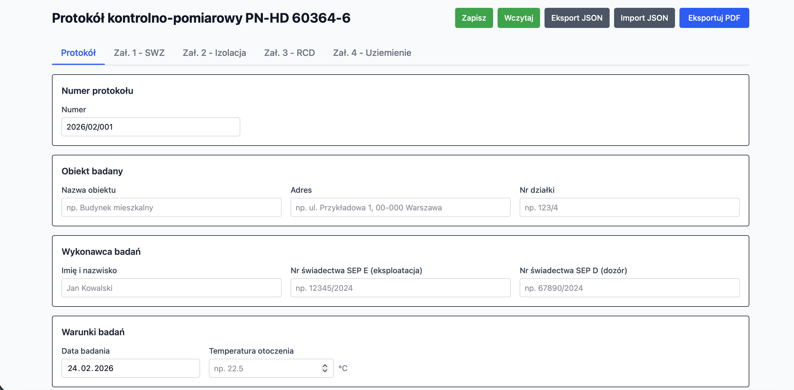
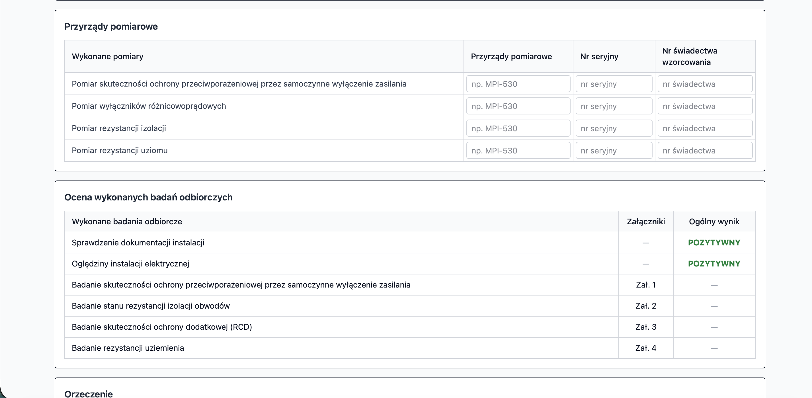
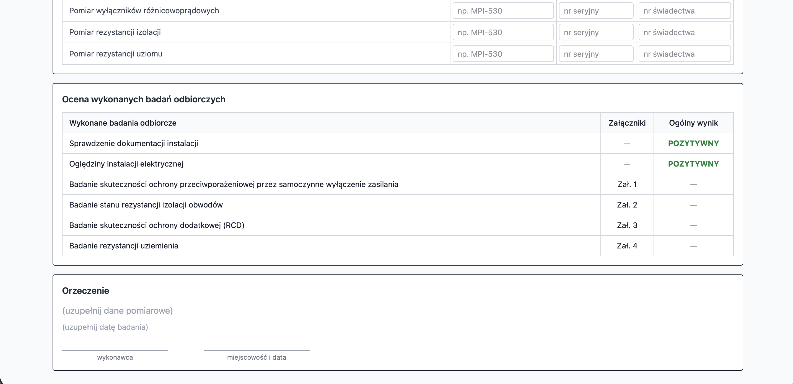
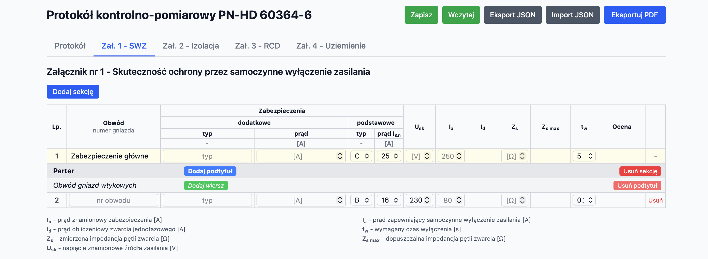
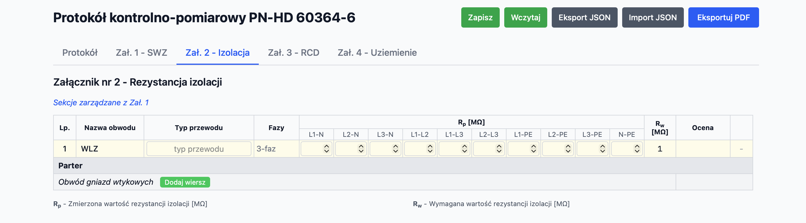
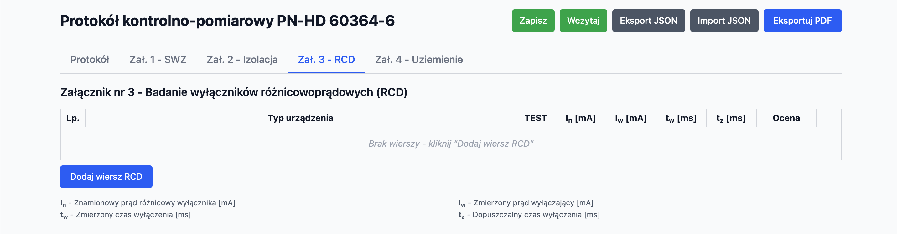
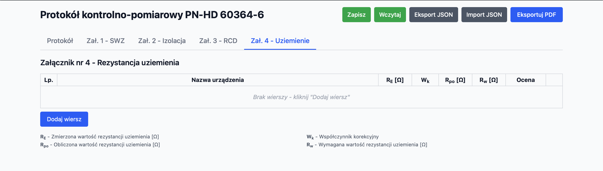

# VoltProtocol

**Generator protokołów kontrolno-pomiarowych PN-HD 60364-6**

Electrical inspection protocol generator per PN-HD 60364-6 — runs entirely in the browser, no installation required.

> Created by **Wojciech Olszak**

<h3 align="center">
  <a href="https://selter2001.github.io/volt-protocol/">Otwórz aplikację / Open App</a>
</h3>

---

## Screenshots

### Formularz główny / Main Form

### Załączniki pomiarowe / Measurement Appendices

---

## PL — Opis

Darmowa aplikacja webowa do generowania protokołów z pomiarów elektrycznych zgodnie z normą **PN-HD 60364-6**.

### Funkcje

- **4 załączniki pomiarowe** — skuteczność zerowania (SWZ), rezystancja izolacji, wyłączniki różnicowoprądowe (RCD), uziemienia
- **Automatyczne obliczenia** — Id, Zsmax, Ia, Rpo, ocena POZYTYWNA/NEGATYWNA
- **Baza zabezpieczeń** — charakterystyki B/C/D z prądami znamionowymi 6–125A
- **Dynamiczne sekcje** — dodawaj/usuwaj sekcje, podtytuły i wiersze pomiarowe
- **Formularz główny** — dane obiektu, wykonawca, przyrządy pomiarowe, ocena końcowa z orzeczeniem
- **Eksport PDF** — profesjonalny protokół do pobrania, polskie znaki, paginacja, landscape dla Zał. 2
- **Zapis/odczyt** — localStorage + eksport/import JSON między komputerami
- **Zero instalacji** — jeden plik HTML, działa w przeglądarce

### Jak używać

1. Otwórz stronę w przeglądarce
2. Wypełnij dane protokołu i pomiary
3. Kliknij **Eksportuj PDF** aby pobrać gotowy protokół
4. Opcjonalnie: **Zapisz** do localStorage lub **Eksport JSON** aby przenieść dane

---

## EN — Description

Free web application for generating electrical measurement protocols according to **PN-HD 60364-6** (Polish implementation of IEC 60364-6).

### Features

- **4 measurement appendices** — loop impedance (SWZ), insulation resistance, RCD testing, earthing
- **Automatic calculations** — fault current, max impedance, protective current, assessed results
- **Protection device database** — B/C/D characteristics, rated currents 6–125A
- **Dynamic sections** — add/remove sections, subsections, and measurement rows
- **Main form** — facility data, inspector details, instruments, final assessment with verdict
- **PDF export** — professional protocol download with Polish characters, pagination, landscape for Appendix 2
- **Save/load** — localStorage persistence + JSON export/import for portability
- **Zero installation** — single HTML file, runs in any modern browser

### Usage

1. Open the page in your browser
2. Fill in protocol data and measurements
3. Click **Eksportuj PDF** to download the completed protocol
4. Optionally: **Zapisz** to save locally or **Eksport JSON** to transfer data

---

## Tech Stack

- Vanilla HTML/CSS/JS — single file, no build step
- [Tailwind CSS v4](https://tailwindcss.com/) (Play CDN)
- [pdfmake 0.3.5](https://pdfmake.github.io/docs/) for PDF generation
- Roboto font for Polish character support (Latin Extended-A)

## Author

**Wojciech Olszak** — [GitHub](https://github.com/selter2001)

## License

[MIT](LICENSE) © 2026 Wojciech Olszak
